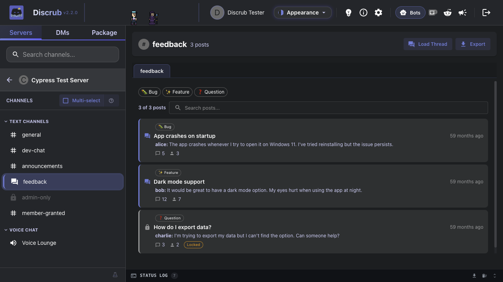
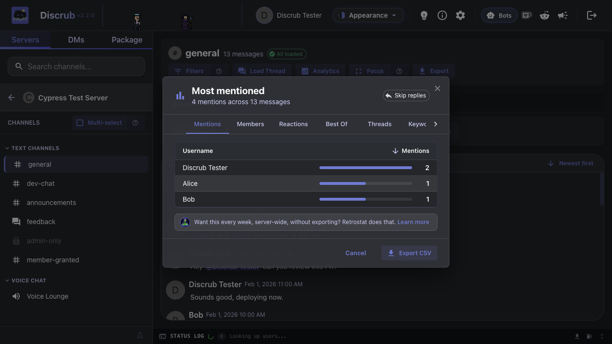
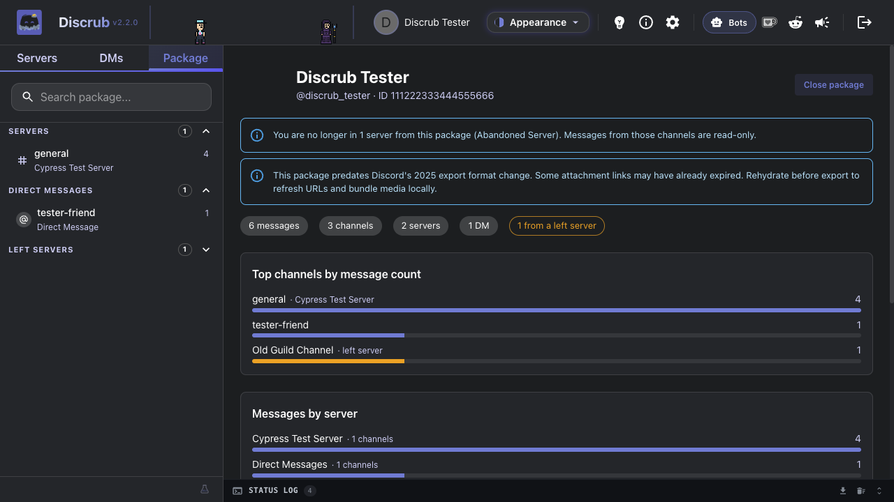
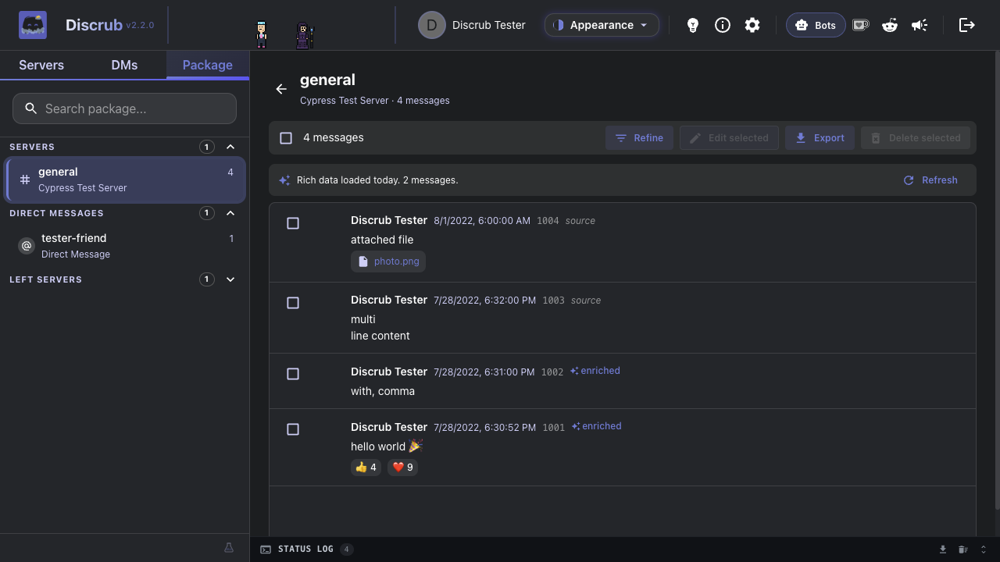
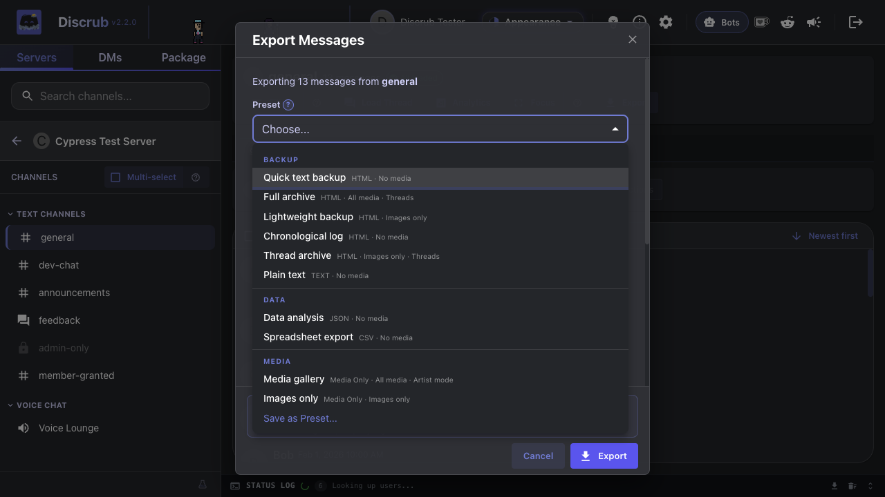
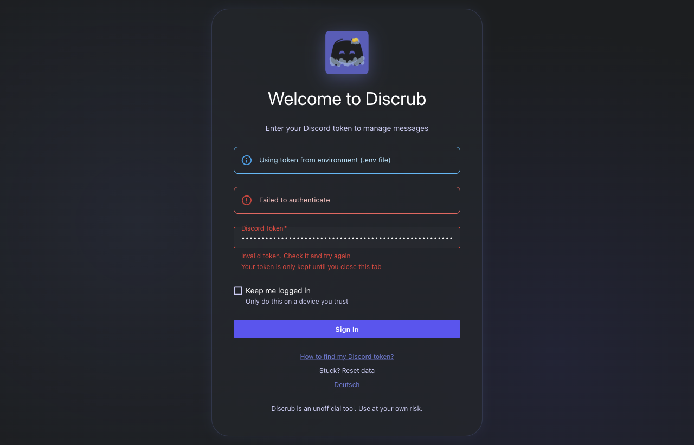
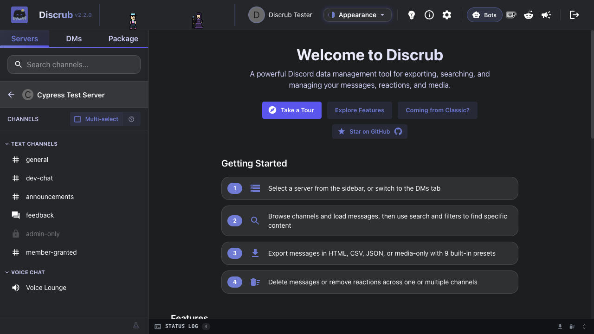
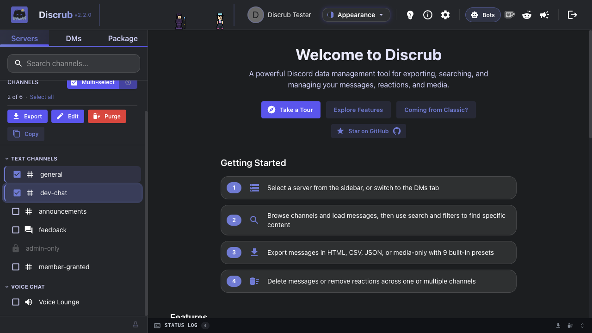
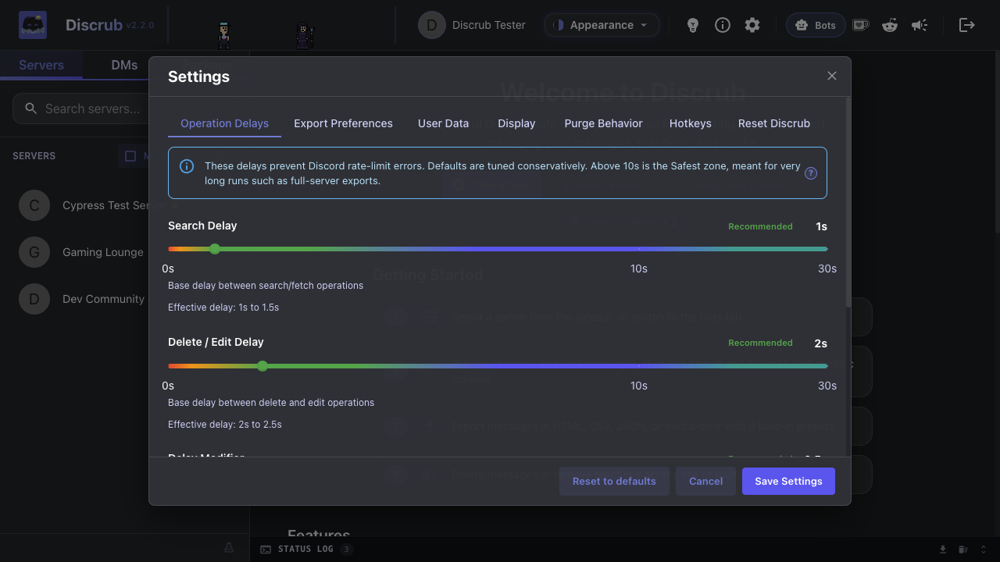
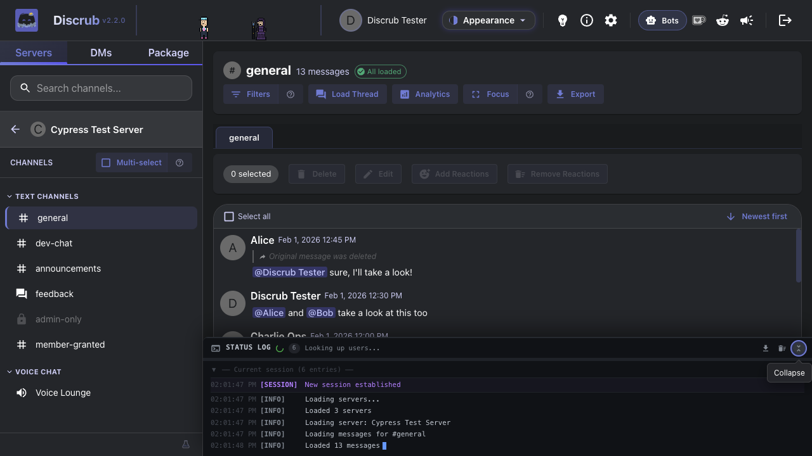

# Upgrading from Discrub Classic

This guide covers what is new in Discrub 2.0, what has changed from Discrub Classic, and how to get started.

---

## Table of Contents

- [What's New](#whats-new)
  - [Major New Features](#major-new-features)
  - [Export Improvements](#export-improvements)
  - [Purge Improvements](#purge-improvements)
  - [Search Improvements](#search-improvements)
- [What's Changed](#whats-changed)
  - [Authentication](#authentication)
  - [Navigation](#navigation)
  - [Settings](#settings)
  - ["Other Files" Media Type](#other-files-media-type)
  - [Operations](#operations)
- [Quick Start for Discrub Classic Users](#quick-start-for-discrub-classic-users)
- [Still Prefer Discrub Classic?](#still-prefer-discrub-classic)

---

## What's New

Discrub 2.0 is the next major version. These features were not in Discrub Classic:

### Major New Features

- **Discord-Style Chunked Feed**: Messages render inline in a Discord-style feed with hover-only gutter timestamps and virtualization for large channels. No separate Preview modal.
- **System Messages**: Pinned, joined, boosted, thread-created and other Discord system events render as compact notices instead of blank rows.
- **Click-to-Jump Navigation**: Click a reply bar, pinned-message notice or thread-created notice to jump to the referenced message. The target row flashes amber.
- **Inline Filter-by-User**: Click an author's avatar or name to open their profile, then filter the channel to messages by them or messages mentioning them. Other active filters are kept.
- **Focus Mode**: Hides the sidebar and status panel for a full-width feed. Press `F` to toggle, `Escape` to exit.
- **Two-Layer Filter Modal**: Search calls Discord's API; Refine narrows loaded messages locally. Date filters take an hour and minute, and a **between two dates** range (Before and After together). Search results load as you scroll with an "X of Y matches loaded" counter. Load All renders pages as they arrive and retries transient network failures.
- **Tour Mode + Targeted Help**: A guided tour runs once for new users. Small `?` icons next to the trickier controls (multi-select, filters, focus, purge mode, pause/resume, operation delays, export presets) open a short explanation on click.
- **Stale-Feed Reload Toast**: After a purge that targets the channel you are viewing, a toast offers to reload the feed so you see Discord's post-purge state.
- **Discord Layout HTML Exports**: Exported HTML wraps in a Discord-like shell with server sidebar, channel navigation and theme toggle, so you can browse between channels in one export.
- **Data Package Import & Rehydration**: Import Discord's "Request All of My Data" ZIP to browse, analyze and re-export your full message history, including servers you have left. The importer handles large packages (multi-gigabyte, ZIP64 archives) and packages exported in any Discord locale (French, German, Spanish, Simplified Chinese, Cyrillic and others). Multi-attachment messages render every attachment. Imports decompress once into IndexedDB, and a reload resumes the package without a re-import. A Filter button on the package message table opens a modal with Content and Date controls that applies locally, and exports honor the active filter. Per-channel Tier 2 rehydration fetches live reactions, mentions, embeds and fresh CDN URLs, with an estimated runtime shown first and a server-wide search preflight that covers most messages in one pass. Once enriched, clicking a reaction chip opens the live ReactionModal to show who reacted.
- **Forum Channel Support**: Discord forum and media channels. Browse active and archived threads, load thread messages, and export them one at a time.
- **Voice and Stage Channel Chat**: The text chat in voice and stage channels can be browsed, exported and purged like any text channel.
- **Thread Discoverability**: The Load Thread modal lists active and archived threads in the current channel. Threads whose starter message was deleted are still reachable without a thread ID.
- **Bulk Reaction Removal & Addition**: Remove reactions across several messages with an emoji picker and user targeting (admins get one-click bulk removal), or **add** one or more emoji to every selected message in one paced, cancelable run.
- **Bulk Edit Across Channels**: Overwrite your own messages across several selected channels or DMs at once, with pause, cancel and per-channel progress.
- **Rich Stickers & Polls**: Sticker-only and poll-only messages render as the sticker image and a poll vote-bar card, in the feed and in HTML exports.
- **Analytics Modal**: Nine ranked reports on the loaded messages (most active members, most mentioned, most reacted, keywords, linked domains and more), each with a chart and CSV export.
- **10 Export Presets**: Quick Text Backup, Full Archive, Data Analysis, Spreadsheet Export, Media Gallery, Lightweight Backup, Chronological Log, Images Only, Thread Archive, Plain Text. Custom presets can be added.
- **Themes**: A theme picker in Settings with live preview. Six free themes (Dark Original, Light Original, Terminal, High Contrast, Overcast, Classic). Supporters unlock eight more cosmetic themes, export theming and a custom export footer with a key emailed from Ko-fi. All features stay free.
- **Donation Wall**: Ko-Fi supporter feed with tiers and a leaderboard.
- **Role Colors & Icons**: Author names colored by their highest role, with role icons in the feed and user profiles.
- **Reply Indicators**: Replies show the referenced author and a preview of the original. Click the reply bar to jump to it.
- **Channel Categories**: Channels grouped by Discord category with collapsible headers.
- **Permission-Based Visibility**: Locked channels show a lock icon, and admin features are gated by Manage Messages.
- **Status Log**: Terminal-style operation log with color-coded entries, downloadable as a `.log` file. Drag the top edge to resize it. History persists across sessions and groups by session.
- **Range Selection**: Shift+Click selects a range in the server, channel and DM lists. In the message feed, click a checkbox and drag to select a range, with edge auto-scroll and thread-tab support.
- **Group DM Distinction**: Group DMs carry a Group chip, show the group's own name when one is set, and are labeled as groups in purge confirmations.
- **Open DM by ID**: Paste a DM channel ID or a user ID to open conversations Discord no longer lists, including closed DMs and DMs with deleted accounts.
- **Skeleton Loading**: Placeholder loading states instead of blank screens.
- **Error Recovery**: Persistent error log with crash recovery and downloadable error reports.

### Export Improvements

| Feature | Discrub Classic | Discrub |
|---------|------------|---------|
| HTML Templates | Standard only | Standard + Discord Layout (default) |
| Export Presets | None | 10 built-in + custom |
| Formats | HTML | HTML, Plain Text, CSV, JSON, Media Only |
| Plain Text Knobs | No | Configurable attachment style, reactions, replies and bot indicator |
| Large HTML Exports | Could crash at thousands of messages | Streamed in chunks so long channels finish |
| Oversized Exports | Single archive, could corrupt past 4 GB | Split into `export.zip`, `export-part2.zip`, ... under a safe size |
| Forwarded Media | Not exported (blank links offline) | Forwarded attachments and embedded images downloaded and rewritten to local copies |
| Stickers & Polls | Not rendered | Sticker images and poll cards rendered in HTML exports |
| Bare Image/GIF Links | Exported as plain URLs | Rendered as inline media, as Discord shows them |
| Preset Date Range | Re-enter each time | Saved presets can remember a date range |
| Thread Filenames | Last write wins on collision | `_<threadId>` suffix so duplicate-named threads keep separate files |
| Media Breakdown | None | Per-type counts and sizes with preview |
| Media File Dates | Downloaded files carried the message's date | Same behavior: media files get the original message date |
| Failing Message Mid-Export | Could abort the whole run | Placeholder row + warning with the message ID; the export continues |
| Dropped Connection Mid-Export | Ended that channel's export | Page fetch retried with backoff; if you are offline the export pauses so you can Resume from the same page. If Discord stops answering while your connection is up, the run stops and asks you to wait |
| Day-Long Runs | Ran flat out until done | Rest breaks: after every 45 minutes of activity the run pauses for 10 minutes, then continues (on by default; Resume skips one) |
| Slow Media Downloads | Flat timeout could cut off large files | Aborts only on a true stall, so slow connections finish large attachments |
| Forum Channels in Bulk Export | N/A | Forums expand into their posts, grouped under the forum's name in the shell |
| README in Export | No | Yes, a bundled guide to the file structure |
| Role Colors in HTML | Basic | Role icons next to author names |
| Reply Bars in HTML | Basic | Formatted content preview |

### Purge Improvements

| Feature | Discrub Classic | Discrub |
|---------|------------|---------|
| Clear All Reactions (admin) | No | Yes (one API call per message) |
| `reaction.me` Optimization | No | Skips emojis you have not reacted with |
| Batch Reaction Removal | No | Remove reactions across selected messages with an emoji picker |
| Strip Attachments Only | No | Edits messages to remove attachments without deleting text (own messages) |
| Bulk Filters | No | Filter bulk purge by author, date range, content, has-types, mentions |
| Archived Thread Handling | Skip with warning | Auto-unarchive, operate, restore archive state, or skip archived threads with "Don't wake archived threads" |
| Preserve Files & Links | No | "Keep messages with files or links" deletes only plain-text messages and keeps anything with an attachment or link |
| Stale-Feed Reload Toast | No | One-click reload after a purge targets the visible channel |
| Pinned Message Preservation | No | Setting the Pinned dropdown to "False" preserves pinned messages, with the count reported in the status log |
| Progress Visibility | Static counter | Status log progress label pulses on each update with milestones (5 / 25 / 100) |
| Deleted Accounts | Search finds nothing, so nothing is purged | Detects the empty search, warns you, and scans the full message history so a deleted user's messages are removed |
| Dropped Connection Mid-Scan | Scan ended quietly | Page fetch retried with backoff while you are offline; a scan that still cannot continue is reported as incomplete. If Discord stops answering while your connection is up, the run stops |
| Multi-Server Purge | No | Select servers in the server list and purge your own messages from every readable channel in each, one operation with per-server progress, pause and cancel |
| Rate-Limit Storms | Waited forever | Five 429s in a row, or a retry_after past 60 seconds, stop the operation with a status-log line instead of pausing for Resume |
| Final Pass | No | After the search runs dry, the newest page of each channel is read directly and matching messages the search index had not caught yet are deleted; the summary reports the count |

### Search Improvements

| Feature | Discrub Classic | Discrub |
|---------|------------|---------|
| Progress Feedback | Basic | Milestone status log entries with operation tracking |
| Client-Side Filter | Basic | Full criteria support with mode indicator |
| Two-Layer Model | Single layer | Search (Discord API) + Refine (local, no API) in one modal |
| Content Terms | One term | Several terms matched any-of, in both Search (one Discord search per term, merged) and Refine |
| Attachment Filters | No | Filter by attachment file type and file name, server-side in Search and locally in Refine |
| Date Precision | Whole days | Hour and minute, with Before, After, or Between two dates |
| Pagination | All at once | 25-message pages with "X of Y matches loaded" counter; Load All renders pages live and retries transient network failures |
| Inline Filter-by-User | No | Click an author, then filter by them or messages mentioning them |
| Filter Lifetime | Criteria persisted across channel switches | Cleared when you switch conversations |
| Indexing Notice | No | Warns when Discord reports a channel's search index is still being built |

---

## What's Changed

### Authentication

- **Discrub Classic:** Reads your Discord token from the Discord page (the extension runs on discord.com)
- **Discrub (Web App):** You enter your Discord token on the landing page
- **Discrub (Extension):** Reads your token like Classic. On first launch, a **splash screen** lets you choose between Discrub 2.0 and Discrub Classic, and the choice is remembered.

Your token is kept in memory only and cleared when you close the tab, unless you tick **Keep me logged in** on the web app's landing page. That saves it as plain text in the browser's site data for that origin until you log out. Either way it never touches a server.

### Navigation

The layout is close to Discrub Classic:
- Server list on the left (same), now with multi-select and a Copy button for server names or IDs
- Channel list with category grouping (new; Discrub Classic showed a flat list)
- Voice and Stage channels appear as clickable rows, and their text chat can be browsed like any text channel
- DMs via a tab switch (same)
- Multi-select mode for bulk operations (a toggle button instead of a separate toolbar)

### Settings

Settings have moved:
- **Discrub Classic:** Settings were in the extension popup or inline panels
- **Discrub:** Settings are behind a gear icon in the top bar, in tabs (Display, Operation Delays, Export Preferences, Purge)

All Discrub Classic settings carry over. New settings:
- UI language (English or German; detected on a fresh install)
- Date and time format
- Operation delays up to 30 seconds, with a Safest zone above 10 seconds for very long runs
- Rest breaks: a long operation pauses for 10 minutes after every 45 minutes of activity (on by default)
- User data refresh rate
- Export template selection
- Export preset management

Save keeps the dialog open and confirms inline; Cancel or the X closes it.

### "Other Files" Media Type

Discrub Classic could download all attachment types, including PDFs, ZIPs and documents. In the web app the "Other files" toggle is hidden, because browser CORS restrictions block non-media downloads from Discord's CDN.

**In extension mode**, "Other files" is available; the extension is not subject to those CORS restrictions.

### Operations

All operations report in the status log at the bottom of the screen instead of inline progress bars. The status log has:
- Color-coded entries with timestamps
- Pause, resume and cancel controls in the status bar
- A downloadable log file for debugging

---

## Quick Start for Discrub Classic Users

1. **Get your token**: In the web app, open Discord in your browser, press F12 to open DevTools, go to the Network tab, click any request to discord.com/api, and copy the `Authorization` header value. The extension signs in for you.

2. **Navigate**: Pick a server, pick a channel, messages load. Channel categories and lock icons on channels you cannot access are new.

3. **Export**: Click the Export button. The dialog has more options, and the defaults work. The default template is "Discord Layout", which makes exported HTML look like Discord.

4. **Purge**: Enter multi-select mode (toggle button on the channel list header), select channels, click the purge icon. The dialog supports Messages, Reactions and Clear All Reactions modes.

5. **Search**: Click "Advanced Search & Filters" above the message table. It works as before, with more criteria and automatic continuation past 5,000 results.

---

## Still Prefer Discrub Classic?

Discrub Classic is **built into the extension**, with no separate install. When you launch Discrub on discord.com, the splash screen lets you choose between Discrub 2.0 and Discrub Classic. Your choice is saved.

For the standalone legacy extension, download it from the [releases page](https://github.com/pratherbytecraft/discrub-ext/releases) and load it by hand in your browser.
