# Discrub

Discrub exports, searches and manages your Discord messages, reactions and media.

It runs as a **web app** (manual token entry) and as a **Chrome/Firefox extension** (signs in on Discord for you).

**Official extension listings.** Fake copies exist on extension stores. These two URLs are the only genuine distributions, also listed in [SECURITY.md](SECURITY.md):

- Chrome Web Store: <https://chromewebstore.google.com/detail/plhdclenpaecffbcefjmpkkbdpkmhhbj>
- Firefox Add-ons: <https://addons.mozilla.org/firefox/addon/discrub/>

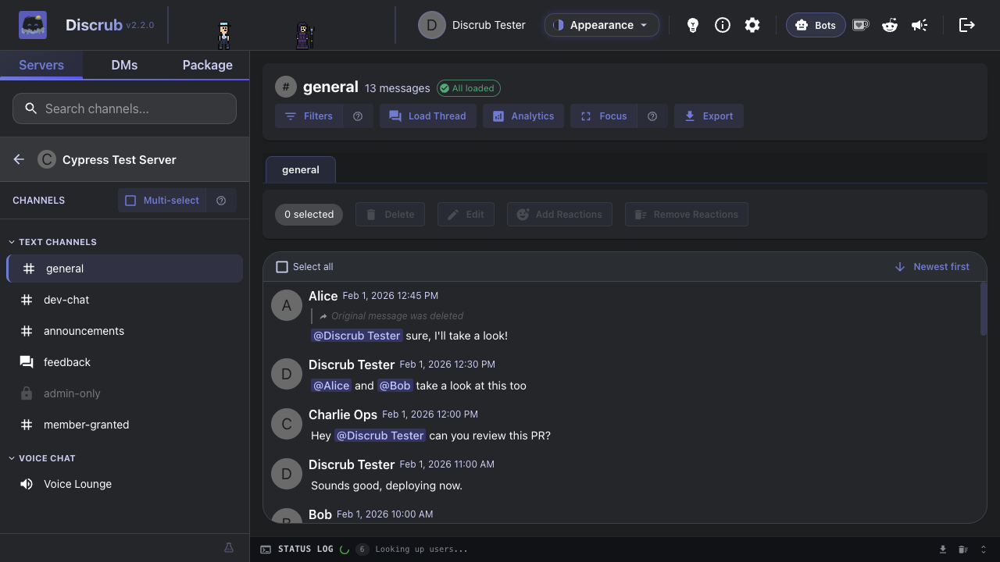

---

## Table of Contents

- [Features](#features)
  - [Browse Servers, Channels & DMs](#browse-servers-channels--dms)
  - [Message Feed, Search & Filters](#message-feed-search--filters)
  - [User Profiles & Quick Filters](#user-profiles--quick-filters)
  - [Click-to-Jump Navigation](#click-to-jump-navigation)
  - [Focus Mode](#focus-mode)
  - [Tour Mode & Targeted Help](#tour-mode--targeted-help)
  - [Export](#export)
  - [Purge](#purge)
  - [Reactions](#reactions)
  - [Message Operations](#message-operations)
  - [Forum Channels](#forum-channels)
  - [Analytics](#analytics)
  - [Data Package Import & Rehydration](#data-package-import--rehydration)
  - [Settings & Preferences](#settings--preferences)
  - [Status Log](#status-log)
  - [Pause, Resume & Cancel](#pause-resume--cancel)
  - [Themes](#themes)
  - [Additional Features](#additional-features)
- [Web App vs Extension](#web-app-vs-extension)
- [Getting Started](#getting-started)
- [Upgrading from Discrub Classic](#upgrading-from-discrub-classic)
- [Development](#development)
- [FAQ](#faq)
- [Tech Stack](#tech-stack)
- [Security](#security)

---

## Features

### Browse Servers, Channels & DMs

Servers show their channel categories. Channels you cannot view carry a lock icon, and channels granted to you by a member-specific permission, such as ticket channels, show as open. DMs list display names. Voice and Stage channels are clickable rows; select one to read its text chat like any text channel.

Multi-select mode works on the Server, Channel and DM lists, with a Copy button for names or IDs. Shift+Click selects a range. Server multi-select has a Purge action that clears your own messages from every selected server in one run.

Group DMs carry a Group chip in the DM list, show the group's own name when one is set, and purge confirmations label them as groups.

**Open DM by ID** (in the DM list) accepts a DM channel ID or a user ID and opens the conversation, including closed DMs and DMs with deleted accounts, so their history stays exportable and purgeable.


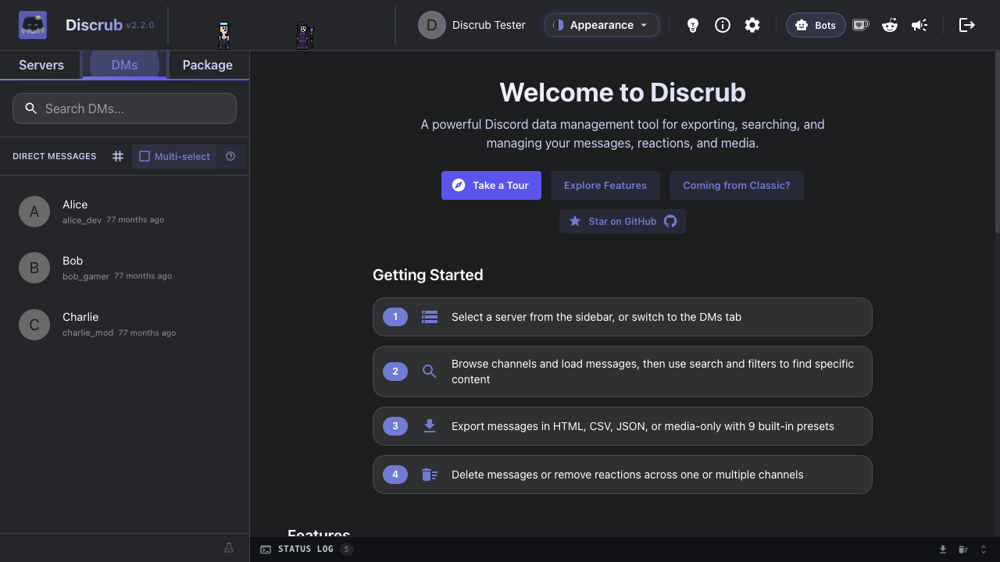

### Message Feed, Search & Filters

A Discord-style chunked feed with inline rendering, role-colored author names, role icons, reply indicators, hover-only gutter timestamps, virtualization for large channels, and system messages (pins, joins, boosts, thread-created) rendered as compact notices. Stickers render as images and polls as vote-bar cards. Forwarded messages render their full content (text, attachments, embeds). System and pinned messages can be selected for bulk actions. Bare image and GIF links render as inline media in the feed and in HTML exports.

To select many messages, click a checkbox and drag (the feed scrolls at the edge), or Shift+Click to extend a selection. Both work in thread tabs.

**Filters** has two layers in one modal:

- **Search** calls Discord's API. Filter by content (one term, or several matched any-of: type a term and press Enter, or separate terms with commas), author, mentions, has-types (image, video, link, file, embed, sound, sticker, snapshot, poll, forward), attachment file type (png, pdf, any list of extensions), exact attachment file name, date range (before, after, or between two dates) with time-of-day precision, pinned status, and author type (human, bot, webhook). Results load as you scroll, the channel header shows `X of Y matches loaded`, and Load All continues past Discord's 5,000-result cap. Load All renders pages as they arrive, retries transient network failures with backoff, and pauses if retries run out so you can Resume. If Discord reports that a channel's search index is still being built, Discrub says so.
- **Refine** narrows the loaded messages locally with no API calls. Content terms match any-of here too. It keeps applying after Load more, and a status entry appears when a new page matched nothing. It has a system-message control to **show only** or **hide** a chosen type (pins, joins, boosts), plus attachment file type and partial file-name match.

Search and Refine criteria clear when you switch to another channel or DM.

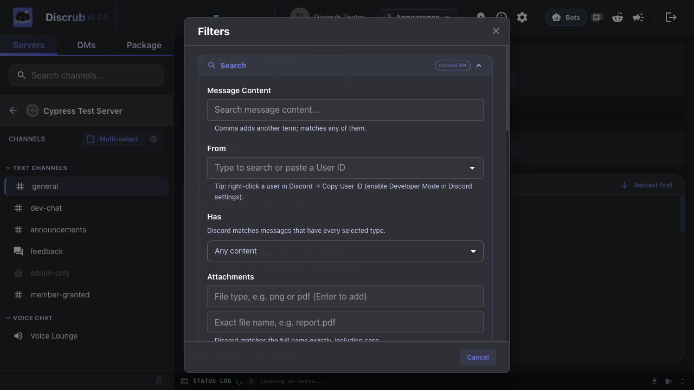

### User Profiles & Quick Filters

Click an avatar or username to open a profile card with display name, server nickname, role colors, role list with icons, badges, account details and profile customization.

The profile modal has two filter shortcuts. **Filter messages by [name]** narrows the channel to messages they wrote. **Filter messages mentioning [name]** narrows to messages that @mention them. Other active filters (date, content) are kept; only the user scope changes.

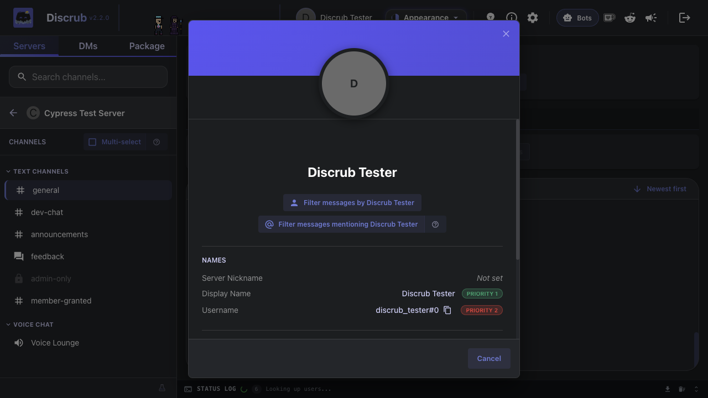

### Click-to-Jump Navigation

Click a **reply bar**, **pinned-message notice** or **thread-created notice** to jump to the referenced message. The target row flashes amber. It works for loaded messages; for a message that is not loaded, a toast asks you to load more first.

### Focus Mode

Hides the sidebar and status panel for a full-width feed. Press `F` to toggle, `Escape` to exit, or use the Focus button in the channel toolbar.

### Tour Mode & Targeted Help

First-time users get a **guided tour**: server browsing, multi-select, filters, exports, focus mode and the message feed. It can be skipped, does not block, and is tracked per version so later changes can show only the relevant steps.

Small **`?` icons** sit next to these controls:
- Multi-select toggle (in channel and DM lists)
- Filters button + Refine section
- Profile quick-filter buttons
- Focus mode toggle
- Search match counter
- Purge mode toggle
- Pause / Resume controls
- Operation Delays setting
- Export preset dropdown

Click a `?` for a short explanation of the feature. It works independently of the tour.

### Export

Five formats:

| Format | Description |
|--------|-------------|
| **HTML** | Styled webpage with avatars, formatting, reactions, role colors and theme toggle |
| **Plain Text** | `.txt` files with configurable attachment style, reactions, replies and bot indicator. Suits archives, grep and plain editors |
| **CSV** | Spreadsheet format |
| **JSON** | Raw data for analysis |
| **Media Only** | Attachments without message content |

Two HTML templates. **Discord Layout** (default) wraps the export in a Discord-like shell with server sidebar, channel navigation grouped under your server's categories, and theme toggle. **Standard** produces standalone HTML pages.

**Export Features:**
- 10 built-in presets (Quick Text Backup, Full Archive, Plain Text, Data Analysis, Media Gallery and more)
- Custom presets
- Per-type media selection (images, videos, audio)
- Configurable messages per page
- Threads and forum posts go to separate files. Threads that share a title get a name suffix so they do not overwrite each other, and the Discord Layout sidebar links stay correct
- Any other zip path collision is renamed on the fly instead of aborting the export
- Forwarded-message media (attachments and embedded images) is downloaded and rewritten to local copies
- Stickers and polls render in HTML exports
- Reaction user data in HTML exports
- Media breakdown bar with file counts and sizes
- Artist mode (media organized by author)
- Sort order (oldest or newest first)
- README.html (HTML, CSV, JSON, Media) or README.txt (Plain Text) in every export
- Large HTML exports stream each page as chunks, so long channels do not hit the V8 string-size cap
- If one message fails to render, it gets a placeholder row in every format and a warning with its ID, and the export continues
- Media downloads abort only when no bytes arrive for a sustained period, so slow connections finish large attachments
- Failed media downloads retry on Discord's alternate CDN, with the HTTP status in the warning (this also fixes WebP attachments)
- Downloaded media files get the message date as their modified date, as in Discrub Classic
- Group DM exports go in a folder named after the group, and orphaned GIF thumbnails no longer produce broken media entries
- Oversized exports split into zip parts (`export.zip`, `export-part2.zip`, ...) under a safe size, so an archive cannot corrupt past the 4 GB / 65,535-entry limit
- Saved presets can remember a date range
- A screen wake lock is held during long exports and purges
- Pacing runs on a worker timer, so a background tab does not slow a long purge or export. Keep the tab open, since tab sleep or memory saver can still end a run

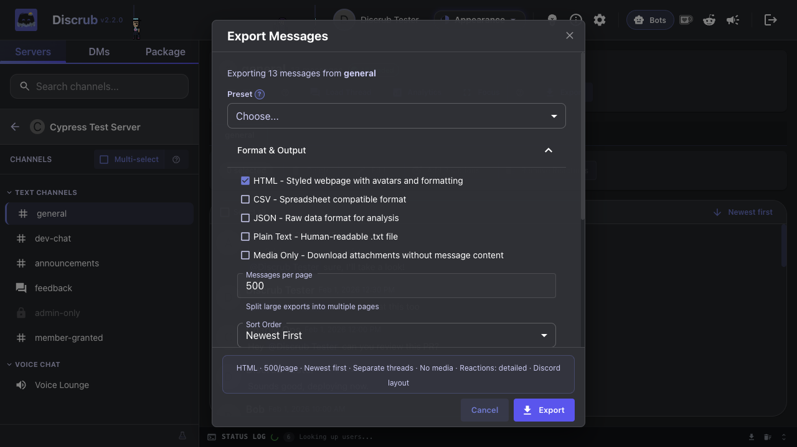
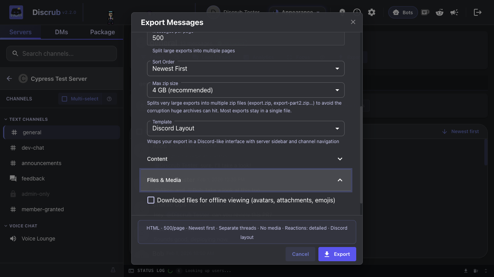

### Purge

Delete messages and reactions across one or more channels, with user targeting:

- **Messages Mode**: search-based deletion with per-user targeting, plus an optional **"Also delete system messages"** section for chosen categories (pins, joins, boosts)
- **Attachments Only**: strip attachments without deleting the text (own messages only, a Discord API limit)
- **Reactions Mode**: remove specific users' reactions from all messages (your own without permission, any user with Manage Messages)
- **Clear All Reactions** (admin): one API call per message

It also has multi-channel selection with Select all, filters (author, content, date, has-types) for bulk export and bulk purge, retain-attachments option, thread-aware discovery (un-archives during purge and re-archives after), DM support (own messages only), and pause, resume and cancel.

**Purge several servers at once.** Turn on multi-select in the server list, tick the servers, and click Purge. Discrub takes the servers one at a time: it loads each server's channels, keeps the readable ones, and runs the same per-channel purge a single server uses. Server purges target your own messages (Messages or Attachments Only). The status log gets a header per server and a final "N of N servers" summary, the status bar shows "Server 2/5 · Channel 3/12", and Cancel finishes the current channel first. A server whose channels cannot be loaded is reported and skipped. Pacing is unchanged, so a run across many servers can take hours, and the run stops on its own if Discord starts rate limiting.

Two options leave things alone. **Don't wake archived threads** skips archived threads instead of un-archiving them (Discord requires un-archiving to delete, which makes old threads reappear for other members); skipped threads are counted in the summary. **Keep messages with files or links** preserves any message with an attachment or a link and deletes only the plain-text messages around them; preserved counts appear in the summary.

Purging a **deleted account's** messages works. Discord's search returns nothing for deleted users, so Discrub warns you and scans the full message history instead.

Setting the Pinned dropdown to **False** preserves pinned messages during a purge. Discord's search ignores `pinned=false`, so Discrub checks before each delete and reports the number of preserved pins in the status log.

While a purge runs, the status log progress label pulses on each update, with milestones every 5 deletes early, then 25, then 100.

**Final pass.** Discord's search index lags on the newest message or two, so after the search runs dry Discrub reads the top of each channel directly, applies the same filters, and deletes what is left. The summary reports how many the final pass caught.

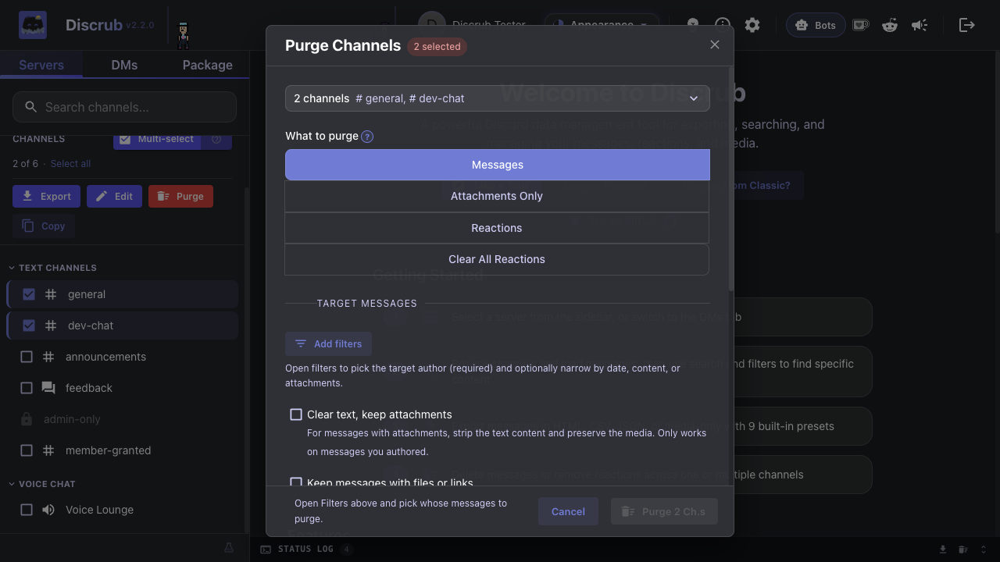

### Reactions

View who reacted to any message and manage reactions per user:

- View reacting users with avatars
- Remove individual reactions (your own, or any with Manage Messages)
- Admin bulk removal of all reactions or all of one emoji in one API call
- Batch removal across selected messages with an emoji picker and user selection
- Batch **addition** across selected messages: pick one or more emoji (server custom emoji, the unicode set, or paste an emoji or shortcode). A live "messages × emoji" count shows the total. The run is paced and cancelable, and failures (no permission, rate limited, message gone) are counted without stopping it
- `reaction.me` optimization skips API calls for emojis you have not reacted with

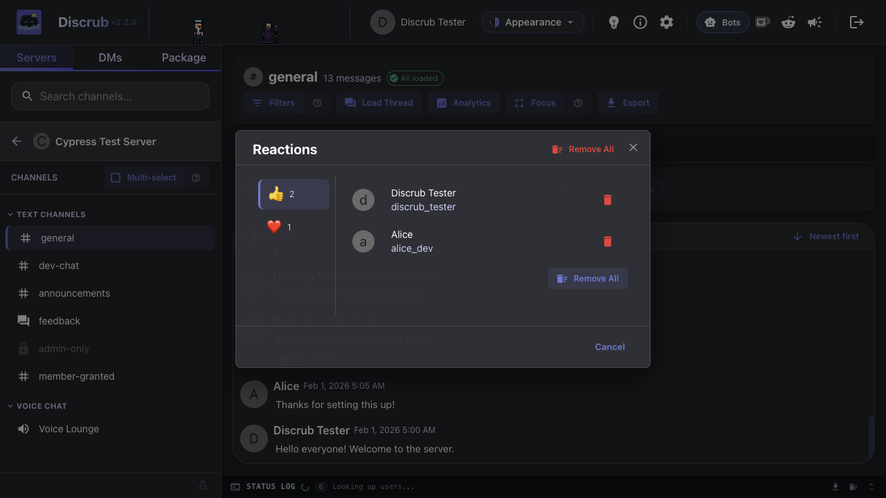

### Message Operations

- **Delete**: single or bulk deletion with confirmation
- **Edit**: single or bulk editing, including across several selected channels or DMs at once (your own messages only), with pause, cancel and per-channel progress
- **Attachment Management**: delete one attachment or all attachments from a message
- **Strip Attachments Only**: keep the text and remove the attachments (own messages only, a Discord API limit)
- **Remove Reactions**: batch removal from the toolbar with emoji and user selection
- **Stale-feed reload toast**: after a purge that targets the channel you are viewing, a toast offers to reload the feed so you see Discord's post-purge state

### Forum Channels

Forum and media channels (Discord channel types 15 and 16):

- Browse forum threads and posts with preview cards
- Search threads by name
- Load thread messages into the message table
- Export forum threads one at a time or as part of bulk exports
- Discovers active and archived threads (public and private)
- Bulk exports expand forum channels into their posts. Every post is exported on its own and the Discord Layout shell groups them under the forum's name

The **Load Thread** modal lists active and archived threads in the current channel (name, member and message counts, and an Archived chip with the archive date), so threads whose starter message was deleted are still reachable without a thread ID. The manual ID input remains.


### Analytics

Nine reports over the loaded messages: Overview (the headline numbers), Most mentioned, Most active members, Most reactions received, Most reacted messages, Most active threads, Keyword mentions, Most linked domains, and Most attachments shared. Every ranked report has a chart and a CSV export. A "Skip Replies" option excludes reply mentions from mention counts.


### Data Package Import & Rehydration

Import the ZIP from Discord's "Request All of My Data" export and browse, analyze, bulk-edit, bulk-delete or re-export your full message history, including servers you have left. Processing happens in your browser; the package file never leaves your device.

The importer handles large packages (multi-gigabyte archives, tens of thousands of entries via ZIP64) and packages exported in any Discord locale (French, German, Spanish, Simplified Chinese, Cyrillic and others). Folder names vary by locale, so Discrub finds the account, messages and servers directories by their content. Multi-attachment messages render every attachment.

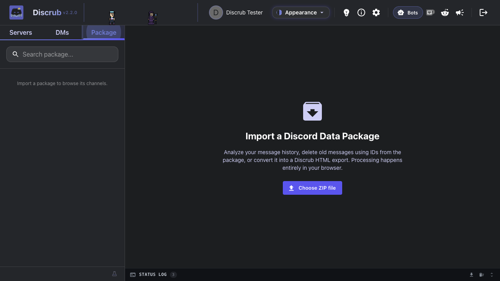

**Analytics on your full message history.** Per-server and per-channel counts, channel-type breakdown, and an optional timeline view (monthly activity and hour-of-day patterns).


**Browse the messages.** Imports decompress once into IndexedDB; per-channel reads come from IDB and never re-decompress the ZIP. Reload the page and the package resumes without a re-import. Messages render with markdown, mention chips, custom emoji and auto-linked URLs. Attachment placeholders keep the original CDN URL. Older packages with unquoted snowflake IDs parse without precision loss across user, server, channel and message metadata.

**Filter package messages.** A Filter button above the package message table opens a FilterModal with Content and Date controls that applies locally, without touching the network. The header shows the filtered count above the total, and exports honor the active filter. After "Load rich data", reaction emoji chips are clickable and open the live ReactionModal to show who reacted (with a Discord token; without one the modal shows "User list not available").

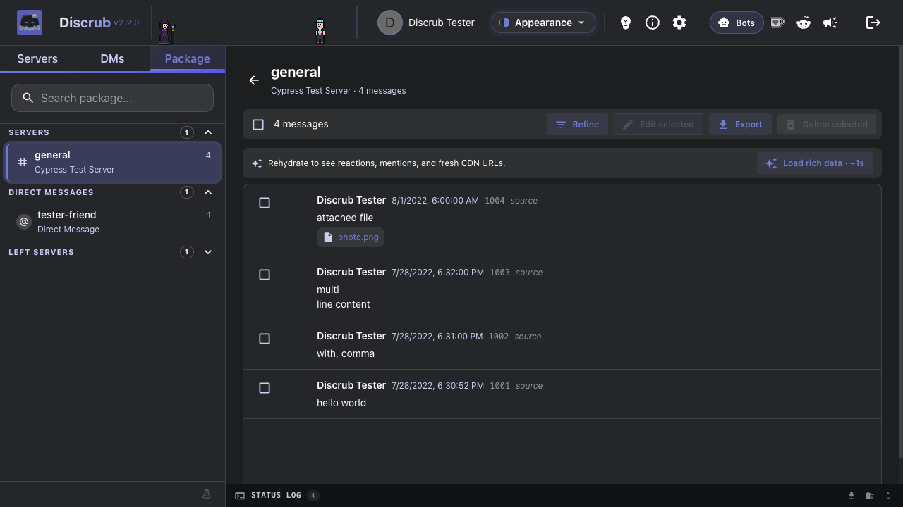

**Tier 2 rehydration (opt-in, per channel).** Click "Load rich data" to fetch live `Message` objects from Discord: reactions, reply quotes, named mentions, embeds, stickers and fresh signed CDN URLs for attachments. The button shows an estimated runtime on hover (X messages, expected duration). A server-wide search preflight covers most messages in one pass before per-message lookups begin, and the status log shows how many package messages that scan served. Results persist to IndexedDB so enriched channels load at once on return. Pause, resume and cancel work as in every other long operation, and partial results are saved on cancel.


Exports work like live exports (same dialog, all presets, all templates) and use the enriched `Message` objects when available. A "Rehydrate before export" toggle enriches the channel first if it has not been rehydrated.

### Settings & Preferences

Settings are split across tabs:

- **Display**: language (English or German; a fresh install follows your browser, and the sign-in screen has a one-word Deutsch / English link), date and time format, DM list order (most recent first, alphabetical, or Discord's own order)
- **User Data**: display name and nickname lookup toggles, reaction enrichment, user data refresh rate
- **Operation Delays**: search and delete delays with a randomization modifier (with a `?` explainer on Discord rate limits), plus rest breaks: after 45 minutes of activity a long operation pauses for 10 minutes on its own (on by default)
- **Export Preferences**: default format, template, media types and all export options
- **Purge Behavior**: default mode (Delete, Strip Attachments Only, Remove Reactions) and media retention

Save keeps the dialog open and shows a short confirmation, so you can keep editing. Close it with Cancel or the X.


### Status Log

Terminal-style operation log with color-coded entries ([INFO], [OK], [ERR], [WARN], [SESSION]), live progress, a downloadable log file, and expand/collapse. It scrolls to the latest entry on open. Drag the top edge to resize it. History persists across sessions and groups by session.


### Pause, Resume & Cancel

All long operations (export, purge, load all, delete, edit, reaction removal) support:
- **Pause**: halt the operation
- **Resume**: continue from where it stopped
- **Cancel**: abort the operation

Controls appear in the status bar while an operation runs. In Focus Mode, or anywhere the status panel is hidden, a floating pause control appears during heavy operations, and the `Space` hotkey still works.

A dropped connection does not end a run. Exports, purge scans, thread Load All and package rehydration retry a failed page fetch with backoff (network errors and server 5xx only; a 4xx is final). Exports and Load All pause when the retries run out so you can fix the network and Resume from the same page. A purge scan that still cannot continue says so in the status log instead of finishing as if it had covered everything.

### Themes

Pick a theme in Settings, with a live preview on hover. Six themes are free: Dark Original (the default), Light Original, Terminal, High Contrast, Overcast and Classic. The picker can also follow your system preference.

Supporters unlock eight more cosmetic themes (AMOLED Void, Synthwave, Bytecraft, Ember, Nekonoir, Circuit, Noir, Abyss), a theme switcher in HTML exports, and a custom export footer. Open the palette icon in the top bar for the Themes hub and paste the key from your Ko-fi email. Every Discrub feature stays free; supporter perks are cosmetic only.


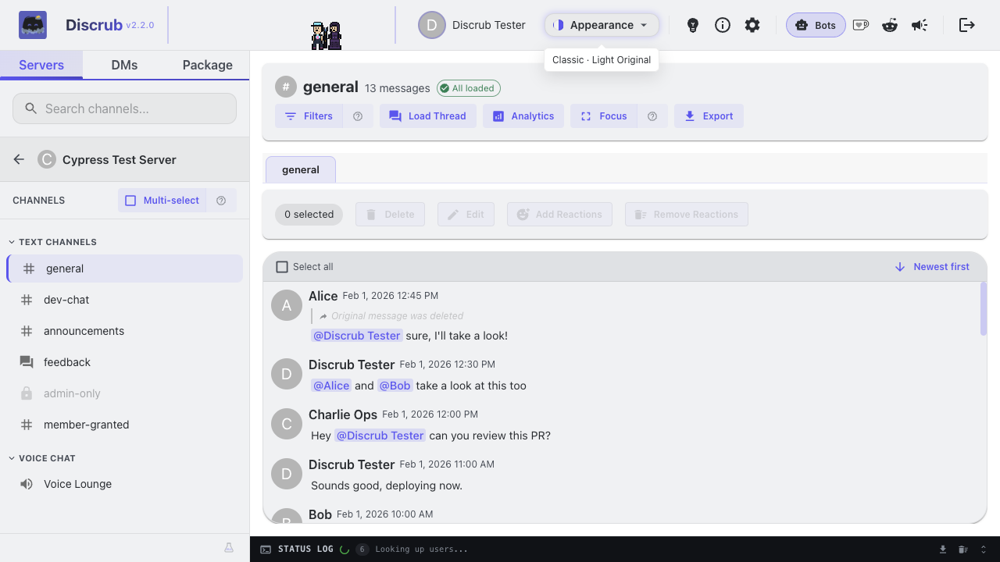

### Language

Discrub runs in English or German. A fresh install follows the browser language. An existing install stays English and, when the browser prefers German, offers the switch once. Change it any time in Settings > Display or with the link on the sign-in screen. The German catalog is machine-drafted. Report a wrong line or ask for another language by opening an issue.

### Additional Features

- **Donation Wall**: Ko-Fi supporter feed with tiers and a leaderboard
- **Ideas & Contact**: links to email and GitHub issues
- **Announcements**: in-app announcements rendered from GitHub-hosted markdown, shown once per version, with a list of every previous announcement in the same dialog
- **From the Discrub team**: a corkboard on the welcome screen with the studio's Discord bots (Retrostat first) and a note from the developer
- **Role Colors & Icons**: author names colored by highest-position role, with role icons next to author names in the feed and user profiles
- **Copy to Clipboard**: copy server, channel or DM lists
- **Reset Discrub Data**: a Settings button that wipes Discrub's local IndexedDB databases, for recovering from corrupted state without uninstalling the extension
- **Error Logging**: persistent error log with download
- **Tab Close Protection**: warns when you close the tab during an operation

---

## Web App vs Extension

| Feature | Web App | Extension (Chrome / Firefox) |
|---------|---------|-----------|
| Authentication | Manual token entry | Auto-retrieves from Discord |
| "Other files" media type | Not available | Available |
| Overlay on Discord | No | Yes (iframe overlay) |
| Minimize to floating tab | No | Yes |
| Settings storage | localStorage | Browser extension storage |
| Installation | None (visit URL) | Install from Web Store / Add-ons |
| Auto-update | Always latest | Browser auto-updates |
| Discrub Classic | Not available | Built-in (select from the launcher splash screen) |

### What differs by setup

Purging, searching and bulk operations behave the same everywhere. Three things differ (the app shows this table under the **Compatibility** info button):

| | Chrome extension | Firefox extension | Bleeding Edge on Chrome | Bleeding Edge on Firefox | Bleeding Edge on mobile |
|---|---|---|---|---|---|
| Sign in | Automatic | Automatic | Manual | Manual | Manual |
| Export size | No limit | Smaller parts | No limit | No limit | Smaller parts |
| Export media | All files | All files | Most files | Most files | Most files |

"Manual" means you paste your Discord token each visit, or tick "Keep me logged in" to keep it in that browser (the extension reads it for you). "Smaller parts" means each zip part is held in memory before it downloads (Firefox extension pages have no service worker; iOS stages through Safari's storage quota), so those setups default to 500 MB parts under Export settings > Max zip size. "Most files" means the hosted build fetches media through Discord's proxy, which refuses a few formats; skipped files are listed in the status log and the messages themselves are always complete.

Both versions use the same codebase and make the same API calls from your browser. The extension includes Discrub Classic (the original interface). When you first launch Discrub, a splash screen lets you choose between Discrub 2.0 and Discrub Classic, and the choice is remembered.

---

## Getting Started

### Web App

1. Visit the hosted Discrub app
2. Get your Discord token:
   - Open Discord in your browser
   - Press `F12` to open DevTools
   - Go to the **Network** tab
   - Click on any request to `discord.com/api`
   - Find the `Authorization` header value; that's your token
3. Paste your token on the Discrub landing page
4. Browse your servers and export

### Finding your Discord token

The web app and the hosted Bleeding Edge build sign in with your Discord user token, which you paste in yourself (the extension picks it up for you). To find it:

1. Open [discord.com/app](https://discord.com/app) in your browser and log in.
2. Open DevTools (`F12`, or `Cmd+Option+I` on a Mac) and switch to the **Network** tab.
3. Click any server or channel so Discord makes a request, then pick a request whose name starts with `messages`, `channels`, or `science` from the list.
4. In the request's **Headers** panel, scroll to **Request Headers** and copy the value of `authorization`. That long string is your token.
5. Paste it into Discrub's token field. Discrub keeps it in memory only and never writes it to disk, unless you tick **Keep me logged in** (web app only). That stores the token as plain text in your browser's site data until you log out, so only use it on a device you control.

Treat the token like a password. Anyone holding it can act as your account, so never share it or paste it anywhere you do not trust. Logging out of Discord, or changing your password, invalidates it, so you will need a fresh one afterwards.

### Extension (Chrome)

1. Install from the [official Chrome Web Store listing](https://chromewebstore.google.com/detail/plhdclenpaecffbcefjmpkkbdpkmhhbj) (or [load manually](#still-prefer-discrub-classic))
2. Navigate to [discord.com](https://discord.com)
3. Click the Discrub icon on the page; a launcher splash screen appears
4. Choose **Discrub 2.0** (modern interface) or **Discrub Classic** (original interface)
5. Discrub reads your Discord token and loads the selected version

### Extension (Firefox)

1. Install from the [official Firefox Add-ons listing](https://addons.mozilla.org/firefox/addon/discrub/) (or [load manually](#still-prefer-discrub-classic))
2. Navigate to [discord.com](https://discord.com)
3. Same launcher and sign-in as Chrome

---

## Upgrading from Discrub Classic

If you are coming from Discrub Classic, the [Onboarding Guide](ONBOARDING.md) covers what is new and what has changed.

### Still prefer Discrub Classic?

You can install the legacy extension by hand from the [releases page](https://github.com/pratherbytecraft/discrub-ext/releases):

**Chrome:**
1. Download the latest Chrome `.zip` from [Releases](https://github.com/pratherbytecraft/discrub-ext/releases)
2. Extract the ZIP file
3. Open Chrome and navigate to `chrome://extensions`
4. Enable **Developer mode** (toggle in the top-right corner)
5. Click **Load unpacked**
6. Select the extracted folder
7. Navigate to [discord.com](https://discord.com); the Discrub Classic overlay appears

**Firefox:**
1. Download the latest Firefox `.zip` from [Releases](https://github.com/pratherbytecraft/discrub-ext/releases)
2. Extract the ZIP file
3. Open Firefox and navigate to `about:debugging#/runtime/this-firefox`
4. Click **Load Temporary Add-on**
5. Select any file inside the extracted folder (e.g., `manifest.json`)
6. Navigate to [discord.com](https://discord.com); the Discrub Classic overlay appears

> Firefox temporary add-ons are removed when the browser closes. For a persistent install, the add-on must be signed or installed from Firefox Add-ons.

---

## Development

Build and tooling notes for project development and source-level review.
Official Discrub distributions are the Chrome Web Store and Firefox Add-ons
listings; see [Getting Started](#getting-started).

### Prerequisites

- Node.js 18+
- npm

### Install Dependencies

```bash
npm install --legacy-peer-deps
```

> The `--legacy-peer-deps` flag is required due to a date-fns peer dependency conflict.

### Development Server

```bash
npm run dev
```

Opens at `http://localhost:3000`. Set `VITE_DISCORD_TOKEN` in a `.env` file to sign in automatically during development.

### Production Build

```bash
npm run build
```

Output in `dist/`.

### Extension Build

```bash
# Chrome
npm run build:extension:chrome

# Firefox
npm run build:extension:firefox

# Both
npm run build:extension
```

### Run Tests

```bash
# Unit tests (Vitest)
npm test

# E2E tests (Cypress; requires a running dev server)
npm run cy:run

# Cross-browser E2E
npm run cy:run:cross-browser

# Storybook
npm run storybook
```

### Regenerate Documentation Screenshots

```bash
npm run demo:screenshots
```

Runs the demo Cypress spec and copies screenshots to `docs/screenshots/`.

---

## FAQ

### Is Discrub safe to use?

Discrub runs in your browser and your Discord token never leaves your device. There is no backend server, no data collection and no analytics. All Discord API calls come from your browser's IP address, the same as using Discord directly.

### Will I get rate limited?

Discrub waits between API calls (default 1s search, 2s delete) with randomization. If Discord returns HTTP 429, Discrub waits the `retry_after` duration before retrying. Adjust delays in Settings > Operation Delays. Search and delete delays go up to 30s; anything above 10s is marked Safest and is meant for very long runs such as a full-server export.

Two more guards run on their own. When Discord keeps rate limiting the account, or stops answering requests while your connection is up, Discrub stops the operation and tells you to wait instead of retrying. After every 45 minutes of activity, a long operation takes a 10 minute rest break (Settings > Operation Delays > Rest breaks, on by default; click Resume to skip one). Long runs without breaks send many requests from your account, so the breaks stay on unless you have a reason to turn them off.

### What about Discord's Terms of Service?

Discrub uses your own user token to access data you already have permission to see. It does not automate account creation, mass-DM, spam or any abusive behavior. It manages data for your own account.

### Why not use a bot instead?

Bots need server admin permissions to be added and use a different authentication flow. Discrub uses your personal user token, so it reaches everything you can already see, including DMs, which bots cannot access.

### Can I export DMs?

Yes. Switch to the DMs tab, select a conversation, and export like any channel.

### What's the difference between Standard and Discord Layout templates?

**Discord Layout** (default) wraps the export in a Discord-like interface with a server sidebar, channel navigation and theme toggle, for bulk exports where you want to browse between channels. **Standard** produces standalone HTML pages without the shell.

### Why can't I see some channels?

Channels you lack permission to view are shown with a lock icon and dimmed. This follows your Discord permissions (role-based, with channel-specific overwrites). Admin users see all channels.

### Can I export media and attachments?

Yes. In the export dialog, expand "Files & Media" to enable media download. You can toggle each type (images, videos, audio). Media is downloaded from Discord's CDN and included in the export ZIP.

> The "Other files" type (PDFs, ZIPs, etc.) is only available in extension mode, due to browser CORS restrictions on non-media file downloads.

### Is there a message limit?

No practical limit. Discord's search API returns up to 5,000 results per query, and Discrub continues past this boundary by adjusting the search window. Load All uses cursor-based pagination with no limit. You can export or purge entire channels regardless of size.

### Can I purge other users' messages or reactions?

Purging other users' messages requires the **Manage Messages** permission in that channel. Without it, you can only delete your own messages. The same applies to reactions: you can always remove your own, and removing others' requires Manage Messages.

### How do I pause or cancel an operation?

While an operation runs (export, purge, delete, etc.), pause and cancel buttons appear in the status bar at the bottom of the screen. Pausing suspends the operation; resume or cancel from there.

### Does Discrub support forum channels?

Yes. Forum and media channels are supported. Discrub discovers active and archived threads (public and private), lists them in a thread view, and exports each thread's messages on its own.

### What happens if I close the tab during an export?

Discrub shows a browser warning before the tab closes during an operation. If you dismiss the warning and close anyway, the operation is lost and partial export data is discarded.

### Can multiple people use Discrub on the same server?

Yes. Each user runs Discrub in their own browser with their own token. There is no shared state and no server-side component. Rate limits apply per user.

### How do I report bugs or request features?

Use the Ideas & Contact button (the lightbulb in the top bar) to reach support@pratherbytecraft.com, GitHub issues, or Ko-fi commissions. On wide windows the Supporter Wall, r/discrub and the latest announcement also sit on the top bar; on narrow ones they fold into the More menu.

### How do I update Discrub?

- **Web app:** always serves the latest version; refresh the page
- **Extension:** Chrome and Firefox update extensions on their own. For manual installs, re-download from the releases page. Reload any Discord tab that was open during the update.

### Does Discrub work offline?

No. Discrub needs an internet connection to reach Discord's API. Exported files (HTML, CSV, JSON) work offline once downloaded.

### What browsers are supported?

Any modern browser (Chrome, Firefox, Edge, Brave, Safari). The extension is available for Chrome and Firefox. E2E tests run against both Chrome and Firefox.

### What is the "Other files" media type?

Non-media attachments such as PDFs, ZIP files and documents. Browser CORS restrictions mean these can only be downloaded in extension mode, where the extension can fetch from any origin. In web app mode, only images, videos and audio download.

### How are role colors determined?

Author names use the color of their highest-position role with a non-zero color, the same logic Discord uses. Role icons (custom images or unicode emojis) from the highest-position role are shown next to author names.

---

## Tech Stack

- **React 18** + **TypeScript** + **Vite**
- **Redux Toolkit** for state management
- **Material UI (MUI)** for components
- **discrub-core** for Discord API communication
- **Vitest** for unit testing (4000+ tests)
- **Cypress** for E2E testing (740+ tests across 41 specs)
- **Storybook** for component development (35 stories)

---

## Security

To verify a downloaded package or report a problem, see
[SECURITY.md](SECURITY.md). It lists the only official store URLs, the extension's
full permission set, and the steps to check a download against the
published SHA-256 checksums (`store/SHA256SUMS.txt`, `scripts/verify-extension.mjs`).

---

## License

All rights reserved. © 2026 Prather Bytecraft.

The source code in this repository is publicly visible for transparency and
security review. Discrub is officially distributed via the Chrome Web Store and
Firefox Add-ons; those are the supported ways to use it.

"Discrub" and the Discrub logo are trademarks of Prather Bytecraft and may not be used
in derivative or competing works.

---

To sponsor a feature or commission a theme, use [Ko-fi Commissions](https://ko-fi.com/prathercc/commissions). For a Discord bot of your own, write to workbench@pratherbytecraft.com.

Built by [Prather Bytecraft](https://github.com/pratherbytecraft) · [pratherbytecraft.com](https://pratherbytecraft.com)
